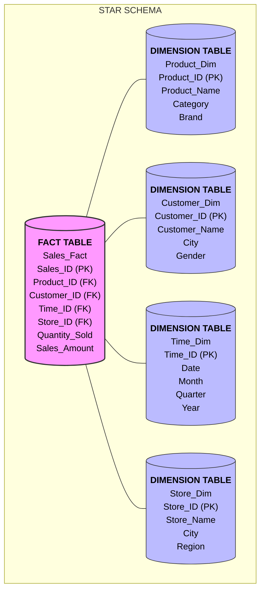
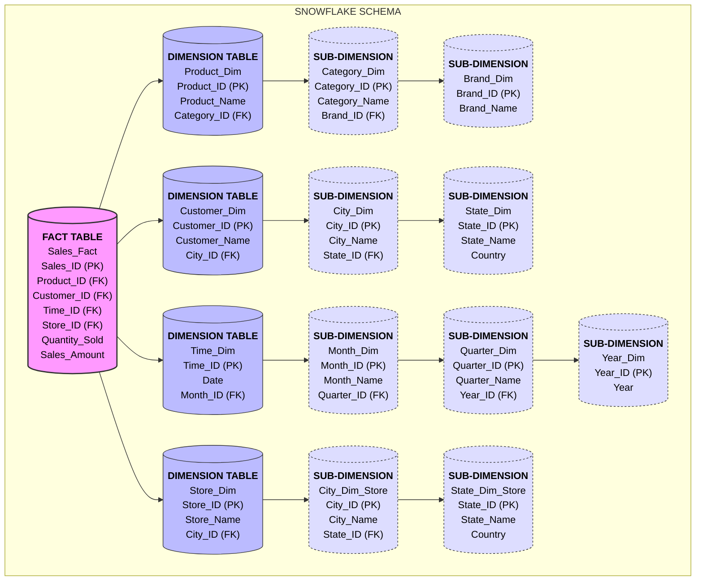

# Dimensional Modeling

## **1. Introduction to Dimensional Modeling** (Page 2-3)

### **What is Dimensional Modeling?**
- A data modeling technique specifically designed for **Data Warehouses**
- Organizes data for **Analysis and Reporting** rather than transaction processing
- Focuses on the **Business view of data** (how business users think)

### **Key Characteristics:**
- **Optimized for OLAP** (Online Analytical Processing) and decision support
- **Simplifies complex data structures** for easier understanding
- **Improves query performance** through denormalization
- **Supports analytical operations**: roll-up, drill-down, slice & dice
- **Easy for non-technical users** to understand and navigate

### **Schema Elements:**
- **Fact Tables**: Store measurable, quantitative data
- **Dimension Tables**: Store descriptive attributes that provide context

---

## **2. Dimension Tables** (Page 5)

### **Definition:**
Dimension tables store **descriptive attributes** that provide context to the facts.

### **Purpose:**
- Used for **filtering** (WHERE clause)
- Used for **grouping/labeling** (GROUP BY)
- Provide **context** to measurements

### **Characteristics:**
- Typically **smaller** than fact tables (fewer rows, more columns)
- Contain **textual attributes** (descriptive)
- Often **denormalized** in star schemas

### **Examples:**

| Dimension | Attributes |
|-----------|------------|
| **Time** | Date, Month, Year, Quarter, Day of Week |
| **Product** | Product_ID, Product_Name, Category, Brand, Supplier |
| **Customer** | Customer_ID, Customer_Name, Location, Age Group, Gender |

### **Example Schema:**
```sql
Product_Dim(
    Product_ID INT PRIMARY KEY,
    Product_Name VARCHAR(50),
    Category VARCHAR(30),
    Brand VARCHAR(30)
)
```

---

## **3. Star Schema** (Page 8-21)

### **Definition:**
A star schema is a dimensional modeling technique where a **central fact table** is surrounded by **directly connected dimension tables**.

### **Structure:**
- **Fact table** at the center
- **Dimension tables** directly connected around it
- Shape resembles a **star** 🌟



### **Characteristics:**
| Feature | Description |
|---------|-------------|
| **Structure** | Simple, denormalized dimensions |
| **Complexity** | Low - easy to understand |
| **Query Performance** | Fast (fewer joins) |
| **Redundancy** | Higher (denormalized) |
| **Storage** | More storage required |
| **User Friendliness** | High - intuitive for business users |

### **Business Case: Retail Sales Analysis** (Page 10-13)

#### **Scenario:**
A retail company wants to analyze sales performance across:
- Products
- Customers
- Time
- Stores

#### **Dimension Tables:**

**Product_Dim:**
```sql
CREATE TABLE Product_Dim (
    Prod_ID INT PRIMARY KEY,
    Product_Name VARCHAR(50),
    Category VARCHAR(30),
    Brand VARCHAR(30)
);
```

**Customer_Dim:**
```sql
CREATE TABLE Customer_Dim (
    Cust_ID INT PRIMARY KEY,
    Customer_Name VARCHAR(50),
    City VARCHAR(30),
    Gender CHAR(1)
);
```

**Time_Dim:**
```sql
CREATE TABLE Time_Dim (
    Time_ID INT PRIMARY KEY,
    Date DATE,
    Month VARCHAR(10),
    Quarter INT,
    Year INT
);
```

**Store_Dim:**
```sql
CREATE TABLE Store_Dim (
    Store_ID INT PRIMARY KEY,
    Store_Name VARCHAR(50),
    City VARCHAR(30),
    Region VARCHAR(30)
);
```

#### **Fact Table - Sales_Fact:**

| Column Name | Description | Type |
|-------------|-------------|------|
| Sales_ID | Surrogate key (PK) | INT |
| Prod_ID | Foreign Key → Product_Dim | INT |
| Cust_ID | Foreign Key → Customer_Dim | INT |
| Time_ID | Foreign Key → Time_Dim | INT |
| Store_ID | Foreign Key → Store_Dim | INT |
| Quantity_Sold | Measure | INT |
| Sales_Amount | Measure | DECIMAL |
| Discount | Measure | DECIMAL |

```sql
CREATE TABLE Sales_Fact (
    Sales_ID INT PRIMARY KEY,
    Prod_ID INT,
    Cust_ID INT,
    Time_ID INT,
    Store_ID INT,
    Quantity_Sold INT,
    Sales_Amount DECIMAL(10,2),
    Discount DECIMAL(5,2),
    FOREIGN KEY (Prod_ID) REFERENCES Product_Dim(Prod_ID),
    FOREIGN KEY (Cust_ID) REFERENCES Customer_Dim(Cust_ID),
    FOREIGN KEY (Time_ID) REFERENCES Time_Dim(Time_ID),
    FOREIGN KEY (Store_ID) REFERENCES Store_Dim(Store_ID)
);
```

---

## **4. Surrogate Keys** (Page 14-15)

### **Definition:**
A **surrogate key** is a system-generated unique identifier used in data warehouses to uniquely identify a record in a table, independent of any business meaning.

### **Characteristics:**
| Property | Description |
|----------|-------------|
| **Generation** | System-generated (auto-increment/sequence) |
| **Business Meaning** | None - purely technical |
| **Stability** | Never changes once assigned |
| **Uniqueness** | Guaranteed unique within table |

### **Why Surrogate Keys?** (Page 15)

#### **Problem with Business Keys:**
Business keys (natural keys) can change over time, making it impossible to track historical changes.

**Example - Customer changes city:**
```
Without Surrogate Key (using Email as key):
Customer_ID (Email) | Name    | City
amit@gmail.com      | Amit    | Mumbai   ← After moving to Pune, this record is overwritten!
                     No way to know Amit ever lived in Mumbai
```

**With Surrogate Key:**
```
Cust_SK | Email_ID        | Name | City
101     | amit@gmail.com  | Amit | Mumbai  ← Historical record
102     | amit@gmail.com  | Amit | Pune    ← New record after move
```

Now we can track that Amit lived in Mumbai, then moved to Pune!

### **Role in Fact Tables:**
- Fact tables **store surrogate keys** as foreign keys
- These keys link facts to the **correct dimension version**
- Enables **accurate historical analysis**

---

## **5. Analytical Queries (OLAP)** (Page 17-21)

### **Query 1: Total Sales by Category and Year**
```sql
SELECT p.Category, t.Year, SUM(f.Sales_Amount) AS Total_Sales
FROM Sales_Fact f
JOIN Product_Dim p ON f.Prod_ID = p.Prod_ID
JOIN Time_Dim t ON f.Time_ID = t.Time_ID
GROUP BY p.Category, t.Year;
```

**Result Example:**
| Category | Year | Total_Sales |
|----------|------|-------------|
| Electronics | 2023 | 4,50,000 |
| Electronics | 2024 | 5,20,000 |
| Furniture | 2023 | 1,80,000 |
| Furniture | 2024 | 2,10,000 |
| Clothing | 2024 | 1,25,000 |

### **Query 2: Total Sales by Region**
```sql
SELECT s.Region, SUM(f.Sales_Amount) AS Total_Sales
FROM Sales_Fact f
JOIN Store_Dim s ON f.Store_ID = s.Store_ID
GROUP BY s.Region;
```

### **Query 3: Monthly Sales Trend for 2024**
```sql
SELECT t.Month, SUM(f.Sales_Amount) AS Monthly_Sales
FROM Sales_Fact f
JOIN Time_Dim t ON f.Time_ID = t.Time_ID
WHERE t.Year = 2024
GROUP BY t.Month;
```

---

## **6. Snowflake Schema** (Page 23-31)

### **Definition:**
A snowflake schema is an **extension of the star schema** where dimension tables are **normalized** into multiple related tables.

### **Structure:**
- Central fact table remains
- Dimension tables are **normalized** (split into sub-dimensions)
- Forms a hierarchical structure resembling a **snowflake** ❄️


### **Example: Product Dimension Normalization**

**Star Schema (Denormalized):**
```
Product_Dim(Product_ID, Product_Name, Category, Brand)
```

**Snowflake Schema (Normalized):**
```
Product_Dim(Product_ID, Product_Name, Category_ID)
Category_Dim(Category_ID, Category_Name, Brand_ID)
Brand_Dim(Brand_ID, Brand_Name)
```

### **Retail Example - Snowflake Schema** (Page 30-31, 33-34)

```sql
-- Fact Table
CREATE TABLE Sales_Fact (
    Sales_ID INT PRIMARY KEY,
    Product_ID INT,
    Time_ID INT,
    Store_ID INT,
    Sales_Amount DECIMAL(10,2),
    Quantity INT,
    FOREIGN KEY (Product_ID) REFERENCES Product_Dim(Product_ID),
    FOREIGN KEY (Time_ID) REFERENCES Time_Dim(Time_ID),
    FOREIGN KEY (Store_ID) REFERENCES Store_Dim(Store_ID)
);

-- Normalized Dimension Tables
CREATE TABLE Product_Dim (
    Product_ID INT PRIMARY KEY,
    Product_Name VARCHAR(50),
    Category_ID INT,
    FOREIGN KEY (Category_ID) REFERENCES Category_Dim(Category_ID)
);

CREATE TABLE Category_Dim (
    Category_ID INT PRIMARY KEY,
    Category_Name VARCHAR(50)
);

CREATE TABLE Store_Dim (
    Store_ID INT PRIMARY KEY,
    Store_Name VARCHAR(50),
    City_ID INT,
    FOREIGN KEY (City_ID) REFERENCES City_Dim(City_ID)
);

CREATE TABLE City_Dim (
    City_ID INT PRIMARY KEY,
    City_Name VARCHAR(50),
    State_ID INT,
    FOREIGN KEY (State_ID) REFERENCES State_Dim(State_ID)
);

CREATE TABLE State_Dim (
    State_ID INT PRIMARY KEY,
    State_Name VARCHAR(50),
    Country VARCHAR(50)
);

CREATE TABLE Time_Dim (
    Time_ID INT PRIMARY KEY,
    Year INT
    -- Other time attributes can be added
);
```

**Important Note:** Fact tables store keys only at the **lowest granularity** (direct relationship). For example, Product_ID in fact table links to Product_Dim, and Category information is derived through the Product → Category relationship.

---

## **7. Star vs Snowflake Comparison** (Page 28)

| Parameter | Star Schema | Snowflake Schema |
|-----------|-------------|------------------|
| **Dimension Design** | Denormalized | Normalized |
| **Complexity** | Simple | Complex |
| **Query Performance** | Faster | Slower (more joins) |
| **Redundancy** | High | Low |
| **Storage** | Higher | Lower |
| **Number of JOINs** | Low | High |
| **User Friendliness** | High | Moderate |

### **When to Use Each:**

| Schema | Best For |
|--------|----------|
| **Star Schema** | • Simplicity and ease of use<br>• Fast query performance<br>• Business users directly querying<br>• Most common data warehouse scenario |
| **Snowflake Schema** | • Large, complex dimensions<br>• When storage is a concern<br>• Maintaining data consistency is critical<br>• Enterprise with detailed hierarchies |

---

## **8. Snowflake Analytical Queries** (Page 37-41)

### **Query 1: Sales by Category and Year**
```sql
SELECT c.Category_Name, t.Year, SUM(f.Sales_Amount) AS Total_Sales
FROM Sales_Fact f
JOIN Product_Dim p ON f.Product_ID = p.Product_ID
JOIN Category_Dim c ON p.Category_ID = c.Category_ID
JOIN Time_Dim t ON f.Time_ID = t.Time_ID
GROUP BY c.Category_Name, t.Year;
```

### **Query 2: Sales by Category, City, State, and Year**
```sql
SELECT c.Category_Name, ci.City_Name, s.State_Name, t.Year, 
       SUM(f.Sales_Amount) AS Total_Sales
FROM Sales_Fact f
JOIN Product_Dim p ON f.Product_ID = p.Product_ID
JOIN Category_Dim c ON p.Category_ID = c.Category_ID
JOIN Store_Dim st ON f.Store_ID = st.Store_ID
JOIN City_Dim ci ON st.City_ID = ci.City_ID
JOIN State_Dim s ON ci.State_ID = s.State_ID
JOIN Time_Dim t ON f.Time_ID = t.Time_ID
GROUP BY c.Category_Name, ci.City_Name, s.State_Name, t.Year;
```

---

## **9. E-Commerce Snowflake Example** (Page 42-46)

### **Business Questions:**
1. Brand performance by country
2. Payment method popularity by quarter
3. Category growth YoY (Year-over-Year)

### **Fact Table: Order_Fact**
```
Order_Fact(
    Order_ID,
    Product_ID,
    Customer_ID,
    Time_ID,
    Payment_ID,
    P_Count,      -- Product count
    Order_Amt      -- Order amount
)
```

### **Dimension Hierarchies:**

| Dimension | Hierarchy |
|-----------|-----------|
| **Product** | Product → Brand → Category |
| **Customer** | Customer → City → State → Country |
| **Time** | Day → Month → Quarter → Year |
| **Payment** | Payment → Payment_Type |

### **Analytical Queries:**

#### **Query 1: Brand Performance by Country**
```sql
SELECT b.Brand_Name, c.Country_Name, SUM(o.Order_Amt) AS Total_Revenue
FROM Order_Fact o
JOIN Product_Dim p ON o.Product_ID = p.Product_ID
JOIN Brand_Dim b ON p.Brand_ID = b.Brand_ID
JOIN Customer_Dim cu ON o.Customer_ID = cu.Customer_ID
JOIN City_Dim ci ON cu.City_ID = ci.City_ID
JOIN State_Dim s ON ci.State_ID = s.State_ID
JOIN Country_Dim c ON s.Country_ID = c.Country_ID
GROUP BY b.Brand_Name, c.Country_Name
ORDER BY Total_Revenue DESC;
```

#### **Query 2: Payment Method Popularity by Quarter**
```sql
SELECT t.Year, t.Quarter, p.Payment_Type, COUNT(o.Order_ID) AS Total_Transactions
FROM Order_Fact o
JOIN Payment_Dim p ON o.Payment_ID = p.Payment_ID
JOIN Time_Dim t ON o.Time_ID = t.Time_ID
GROUP BY t.Year, t.Quarter, p.Payment_Type
ORDER BY t.Year, t.Quarter, Total_Transactions DESC;
```

#### **Query 3: Category YoY Growth**
```sql
-- Calculate Year-over-Year growth percentage
-- YoY Growth % = (Current Year - Previous Year) / Previous Year × 100

SELECT 
    c.Category_Name,
    t.Year AS Current_Year,
    SUM(CASE WHEN t.Year = 2024 THEN o.Order_Amt ELSE 0 END) AS Current_Sales,
    SUM(CASE WHEN t.Year = 2023 THEN o.Order_Amt ELSE 0 END) AS Previous_Sales,
    (SUM(CASE WHEN t.Year = 2024 THEN o.Order_Amt ELSE 0 END) - 
     SUM(CASE WHEN t.Year = 2023 THEN o.Order_Amt ELSE 0 END)) * 100.0 /
     NULLIF(SUM(CASE WHEN t.Year = 2023 THEN o.Order_Amt ELSE 0 END), 0) AS YoY_Growth_Percent
FROM Order_Fact o
JOIN Product_Dim p ON o.Product_ID = p.Product_ID
JOIN Category_Dim c ON p.Category_ID = c.Category_ID
JOIN Time_Dim t ON o.Time_ID = t.Time_ID
WHERE t.Year IN (2023, 2024)
GROUP BY c.Category_Name, t.Year;
```

**Result Example:**
| Category_Name | Current_Year | Current_Sales | Previous_Sales | YoY_Growth_Percent |
|---------------|--------------|---------------|----------------|-------------------|
| Electronics | 2024 | 12,50,000 | 10,00,000 | 25.00 |
| Clothing | 2024 | 8,40,000 | 8,00,000 | 5.00 |
| Grocery | 2024 | 15,75,000 | 14,50,000 | 8.62 |
| Furniture | 2024 | 6,00,000 | 7,50,000 | -20.00 |

---

## **10. Key Takeaways**

### **Dimensional Modeling Summary:**

| Concept | Description |
|---------|-------------|
| **Fact Tables** | Store measurements/numbers (sales amount, quantity) |
| **Dimension Tables** | Store descriptive context (product names, categories) |
| **Star Schema** | Simple, denormalized, fast queries |
| **Snowflake Schema** | Normalized dimensions, less redundancy, more joins |
| **Surrogate Keys** | System-generated IDs for tracking historical changes |
| **OLAP Queries** | Analytical queries with aggregations and groupings |

### **Design Principles:**
1. **Focus on business processes**, not system transactions
2. **Identify facts** (what you're measuring)
3. **Identify dimensions** (how you're slicing the data)
4. **Choose granularity** (level of detail)
5. **Design for query performance** and user understanding

---

## **📝 Self-Study Exercises** (Page 22)

### **Healthcare System:**
Design a star/snowflake schema for analyzing:
- Patient visits
- Treatments
- Billing

### **Banking System:**
Design a schema for analyzing:
- Accounts
- Loans
- Transactions

---

*This comprehensive guide covers all topics from the dimensional modeling presentation. Use it as a reference for understanding data warehouse design principles, star and snowflake schemas, and analytical query patterns.*
